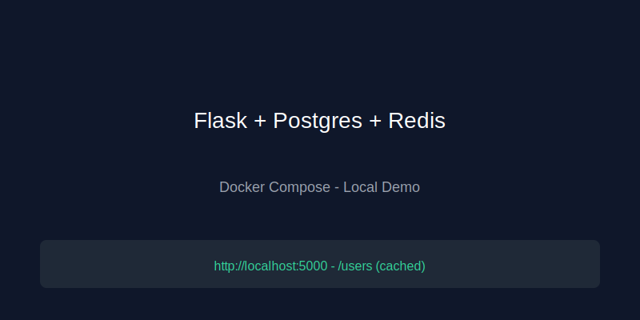

# ?? Flask + PostgreSQL + Redis (Dockerized Backend)

A production-ready backend demonstrating:
- Flask REST API
- PostgreSQL database
- Redis caching
- Docker multi-container setup using Docker Compose

This project simulates real backend architecture used by top companies.

---

## ?? Features

### ? Flask (API Layer)
- Add users  
- Get all users  
- Cache-enabled routes  
- Clear cache endpoint  

### ? PostgreSQL (Database)
- Stores all user records  
- Auto-creates tables  
- Persistent storage using Docker volumes  

### ? Redis (Caching)
- Stores user list for faster reads  
- Cache invalidates automatically on new user insert  
- Manual cache reset available  

### ? Dockerized Setup
- Flask, Redis, PostgreSQL run in separate containers  
- Orchestrated using docker-compose.yml  
- All services communicate over internal Docker network  

---

## ?? Architecture Diagram

---

## ?? Project Structure

---

## ?? Project Structure

### **Stop Services**

---

## ?? API Endpoints

### **1?? Add User**
**POST** /add_user

### **2?? Get All Users**
**GET** /users

### **3?? Clear Cache**
**POST** /clear_cache

---

## ?? Tech Stack
- Python + Flask  
- PostgreSQL  
- Redis  
- Docker  
- Docker Compose  

---

## ????? Author
**Gagana Shree**  
Backend Developer Portfolio Project  
  
## ?? Screenshots

**App running (example):**

## ?? API Documentation

### ? Add User  
**POST** /add_user  
Body:
{
  \"name\": \"Gagana\"
}

---

### ?? Get Users  
**GET** /users

Returns:
- "source": "cache" ? if data comes from Redis  
- "source": "database" ? if data comes from PostgreSQL  

---

### ? Update User  
**PUT** /update_user/<id>  
Body:
{
  \"name\": \"NewName\"
}

---

### ? Delete User  
**DELETE** /delete_user/<id>

---

### ?? Clear Cache  
**POST** /clear_cache

---

## ?? GitHub Badges

